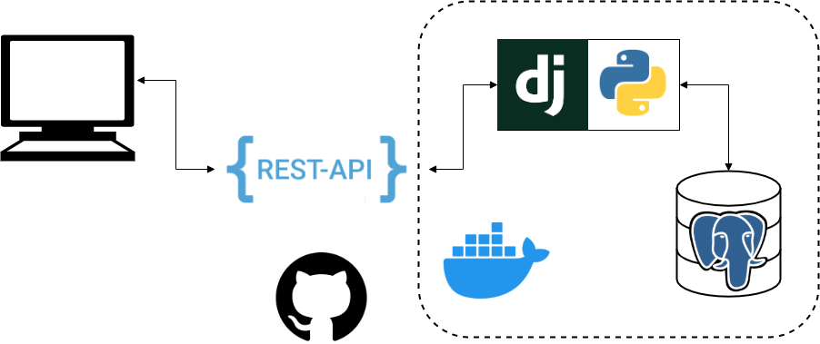

# distributed-computing-course
Запуск: docker-compose up

Ветка реализует сервис авторизации (4 задание)

Добавил запросы для сервиса авторизации, теперь изменяющие запросы требуют access_token

(Делал запросы через Authorization -> Bearer Token)

Запросы:

Регистрация:

PUT /register {"email":, "password":} -> HTTP_STATUS_200_OK, или если почта уже занята, возвращает ошиюку

Авторизация:

POST /authorize {"email":, "password":} -> ("access_token":, "refresh_token":}

Новая пара токенов:

POST /refresh ("refresh_token":} -> ("access_token":, "refresh_token":}

Проверка токена

GET /verify ("access_token":} -> OK / NOT_OK

____________________________________________

GET /product {"id":id} - получение товара по указанному id

PUT /product {"title":title,"category":category} - создать новый продукт с указанным названием и категорией, категория опциональная

DELETE /product {"id":id} - удаление продукта по id

POST /product {"id":id,"title":title,"category":category} - изменение продукта с id=id, новые title, category опциональные, если их не передавать - остается старое значение

GET /products {"page":page,"page_size":page_size} - список всех продуктов, пагинация по размеру страницы page_size, номер страницы page

PUT /init - запрос для тестирования, создаёт 10 продуктов в базе данных

